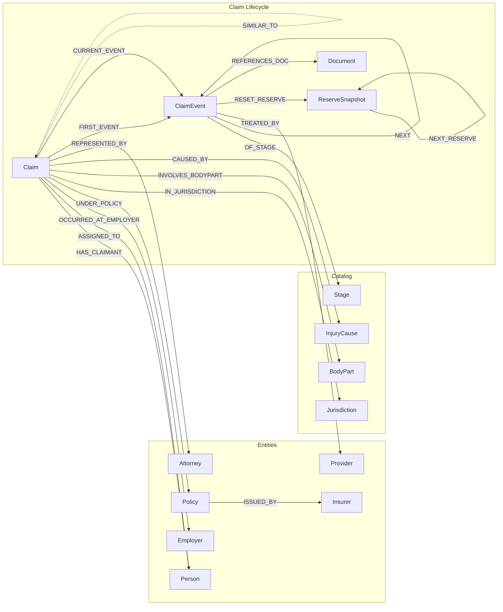
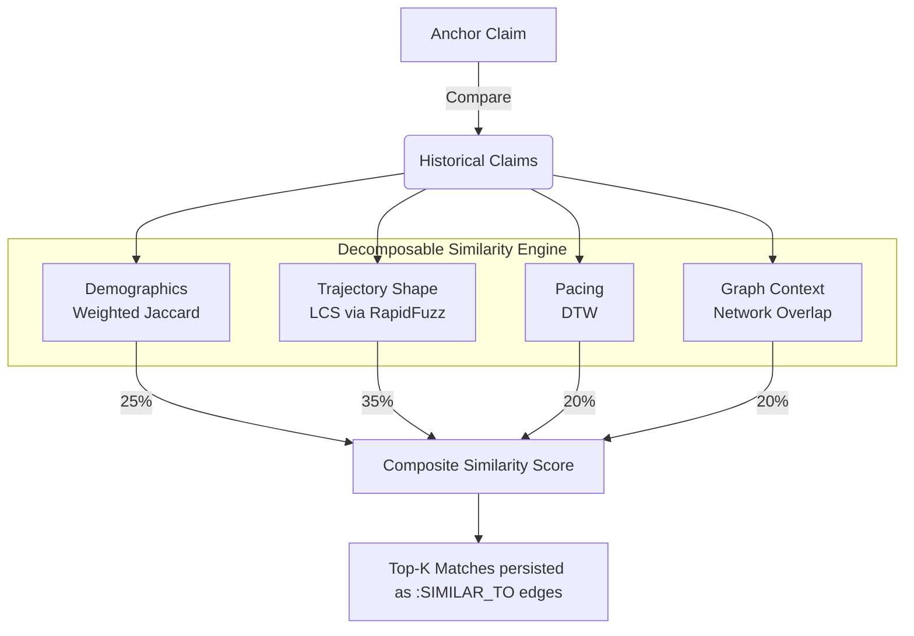

# Workers' Compensation Knowledge Graph Demo
## Business & Technical User Manual

---

## 1. Executive Summary

Traditional claims systems model data relationally—capturing the "who," "what," and "how much" in disconnected tables. While excellent for processing transactions, this approach struggles to capture the **temporal shape** of a claim. Adjusters rely heavily on intuition to detect when a claim begins to "spiral" or deviate from the norm.

This Knowledge Graph Demo illustrates how modeling Workers' Compensation (WC) claims as **Temporal Event Chains** inside Neo4j unlocks a new paradigm in claims intelligence. By representing each claim not just as a row of data, but as a path of interconnected events over time, we can programmatically identify **functionally similar claims**—giving adjusters and claims leadership predictive foresight into reserve adequacy, litigation risk, and optimal medical interventions.

### The Value Proposition
* **For the Adjuster:** "What happened to the last 10 claims that looked exactly like this one at Day 90, and what intervention prevented them from spiraling?"
* **For Claims Leadership:** "Are our reserves accurately reflecting the actual trajectory this claim is taking, rather than just the initial diagnosis?"
* **For Data Science:** Decomposing claim similarity into distinct features (demographics, timeline shape, pacing, and provider networks) rather than relying on black-box ML models.

---

## 2. Core Concepts: The Temporal Graph Model

At the heart of this platform is a fundamental shift in how data is structured.

### 2.1 The Event Chain
Instead of updating a single "Claim Status" field, the graph models the claim lifecycle as a chronological sequence of `ClaimEvent` nodes connected by `:NEXT` relationships.
* A claim points to its starting point via a `:FIRST_EVENT` relationship.
* It points to its current state via a `:CURRENT_EVENT` relationship.
* Each event is categorized by an IAIABC-aligned `Stage` (e.g., First Report of Injury, IME Ordered, Surgery Authorized).

### 2.2 The Reserve Staircase
Reserves are not overwritten. When a material event occurs (e.g., Surgery Authorized), a `:RESET_RESERVE` relationship connects that event to a `ReserveSnapshot` node. This allows the graph to visualize the "reserve staircase"—showing exactly *when* and *why* financial exposure escalated.

### 2.3 The Entity Neighborhood
Claims do not exist in a vacuum. The graph inherently links a claim to the real-world entities involved:
* `:HAS_CLAIMANT` -> Person
* `:ASSIGNED_TO` -> Adjuster
* `:OCCURRED_AT_EMPLOYER` -> Employer
* `:REPRESENTED_BY` -> Attorney
* `:TREATED_BY` -> Provider (linked directly from medical events)

*Technical Note:* This schema guarantees that querying "Which claims share the same Plaintiff Attorney and the same Physical Therapy Provider?" is a fast, native traversal rather than an expensive multi-table SQL join.

---

## 3. The Similarity Algorithm

The platform features a proprietary, four-component similarity engine. When an adjuster looks at an anchor claim, the system evaluates all other claims across four distinct dimensions to find the closest matches.

1. **Demographic Match (25% default weight):** 
   * *Metric:* Weighted Jaccard Similarity.
   * *What it measures:* Do these claims share the same body part, injury cause, employer industry, and claimant age/wage band?
2. **Trajectory Shape (35% default weight):** 
   * *Metric:* Longest Common Subsequence (LCS).
   * *What it measures:* Did these claims go through the same sequence of events? Did they both require an IME and then go to Mediation?
   * *Prefix Matching:* If comparing an open claim (Day 90) to a closed claim (Day 400), the system truncates the closed claim to Day 90 to see if their *beginnings* match.
3. **Pacing (20% default weight):** 
   * *Metric:* Dynamic Time Warping (DTW).
   * *What it measures:* Even if they took the same steps, did they happen at the same speed? A claim lingering in physical therapy for 180 days is fundamentally different from one finishing in 30 days.
4. **Graph Neighborhood (20% default weight):** 
   * *Metric:* Network Overlap.
   * *What it measures:* Are the same real-world actors involved? E.g., The same specific combination of a high-billing surgeon and a litigious attorney.

---

## 4. Using the Application

The application is built using Streamlit and is divided into three main modules accessible via the left sidebar.

### 4.1 Portfolio Overview
Designed for claims managers and executives.
* **Top KPIs:** Immediate visibility into total open claims, outstanding reserves, stale claims (>180 days), and claims currently in dispute.
* **Claim Roster:** A filterable grid of all claims in the system.
* **Deep Dive Panel:** Clicking a claim renders two critical visuals:
  * **Trajectory Gantt Chart:** A chronological plot of the claim's events, color-coded by phase (Intake, Investigation, Active Treatment, Resolution).
  * **Entity Neighborhood Graph:** A visual, interactive node-link diagram showing the people and organizations connected to the claim.

### 4.2 Similarity Workbench
Designed for the frontline adjuster and technical data analysts. This is where the predictive power of the graph shines.
* **Configuration Panel:** Users can dynamically adjust the weights of the four similarity algorithms. If an adjuster suspects a specific Provider is driving costs, they can crank up the "Graph Neighborhood" weight.
* **Top Similar Claims:** Displays the closest historical claims, including their ultimate total paid costs. This serves as a highly accurate, peer-derived reserve benchmark.
* **Trajectory Alignment Comparison:** The killer feature. It plots the Anchor claim directly above a selected Neighbor claim. By visually aligning their timelines, an adjuster can instantly see where a historical claim "went off the rails" and predict the likely next steps for their current open claim.

### 4.3 Admin & Schema
Designed for IT and Data Engineering.
* Monitors database health and node/relationship counts.
* Provides one-click buttons to generate the synthetic data payloads and run the offline similarity engine.

---

## 5. Scripted "Hero" Scenarios

The synthetic dataset contains ~400 claims, but 8 claims have been specifically engineered to demonstrate the platform's value proposition in live demonstrations. These are accessible via the "Quick Select" dropdown in the Similarity Workbench.

**Hero Scenario 1: The Lumbar Litigation Fork (`CLM-HERO-01`)**
* **The Situation:** An open lumbar strain claim, 14 weeks old, currently stuck in the IME (Independent Medical Exam) phase. Current reserve is $25,000.
* **The Insight:** When viewing similar closed claims, a distinct fork appears. Similar claims that were assigned Nurse Case Management (NCM) settled for an average of $55,000. Claims that lacked NCM spiraled into litigation and settled for $180,000.
* **Business Value:** The graph proactively suggests an intervention (assign NCM) that historically saves $125,000 on this specific claim archetype.

**Hero Scenario 2: The Provider Outlier (`CLM-HERO-02`)**
* **The Situation:** An open shoulder surgery claim at Day 90.
* **The Insight:** The trajectory is standard, but the similarity engine (when Graph Neighborhood is weighted heavily) flags an anomaly. Similar claims cluster tightly at $65K-$85K, but a subgroup sharing this specific Physical Therapy provider consistently balloons past $150K due to extended, unnecessary treatments.
* **Business Value:** Highlights network leakage and vendor management opportunities.

---

## 6. Technical Data Dictionary

| Node Label | Description | Example Properties |
| :--- | :--- | :--- |
| `Claim` | The central anchor for a WC case. | `claim_id`, `status`, `date_of_injury`, `current_reserve` |
| `ClaimEvent` | A specific temporal occurrence. | `event_id`, `stage`, `occurred_at`, `duration_days` |
| `ReserveSnapshot` | A historical record of financial exposure. | `snapshot_id`, `amount`, `date` |
| `Person` | Claimants and Adjusters. | `person_id`, `role`, `name`, `age_band` |
| `Provider` | Medical facilities and doctors. | `provider_id`, `specialty`, `npi`, `performance_score` |
| `Employer` | The policyholder where the injury occurred. | `employer_id`, `naics`, `industry` |
| `Stage` | Catalog of IAIABC MTC codes. | `code`, `phase`, `label` |

| Edge Type | Source Node | Target Node | Description |
| :--- | :--- | :--- | :--- |
| `NEXT` | `ClaimEvent` | `ClaimEvent` | The chronological chain of events. |
| `CURRENT_EVENT` | `Claim` | `ClaimEvent` | Pointer to the active stage. |
| `RESET_RESERVE`| `ClaimEvent` | `ReserveSnapshot`| Links a material event to its financial impact. |
| `SIMILAR_TO` | `Claim` | `Claim` | The algorithmic relationship holding demo/shape/pace scores. |
